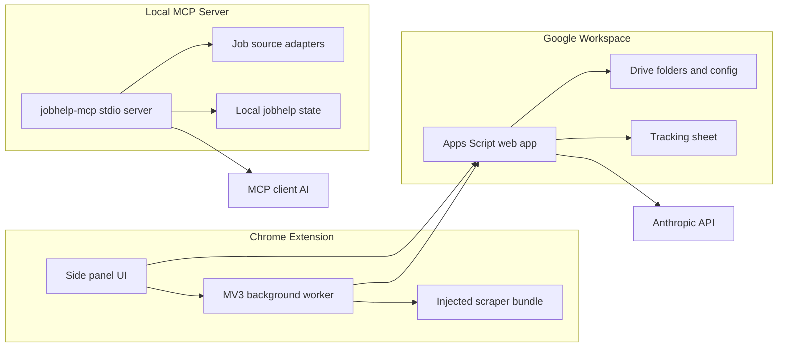

# JobHelp

JobHelp is a personal job-application workspace with two related products:

- **Extension app**: a Chrome side-panel extension plus a Google Apps Script backend for tailoring resumes from job postings, exporting documents, and logging applications to Google Sheets.
- **JobHelp MCP**: a local Model Context Protocol server for job discovery, ranking, resume context, application artifacts, and AI-assisted tailoring workflows inside MCP-compatible clients.

The two products share the same repo and rule philosophy, but they are intentionally separated so each can be built, tested, documented, and shipped on its own.

## Which Product Should I Use?

| Goal | Use |
| --- | --- |
| Tailor a resume from the job page currently open in Chrome | Extension app |
| Generate a Google Doc, DOCX, PDF, cover letter, critique, and tracking-sheet row | Extension app |
| Discover and rank jobs from configured job sources | JobHelp MCP |
| Work inside Claude Code, Claude Desktop, Cursor, or another local MCP client | JobHelp MCP |
| Batch-tailor resumes with validation and application folders | JobHelp MCP |

## Architecture



## Repository Layout

```text
extension-app/
  README.md                     Extension app product guide
  extension/                    Chrome Manifest V3 extension
  appsscript/                   Apps Script backend source and bundle
  prompts/shared/               Resume and cover-letter rule files
  tests/                        Cross-package contract, smoke, and fixture tests

jobhelp-mcp/
  README.md                     MCP install and usage guide
  mcp/src/                      MCP tools, resources, prompts, and wiring
  core/                         Source adapters, ranking, state, resumes, rules
  prompts-bundle/               Rule bundle shipped with the MCP package
  tests/                        MCP and core regression tests

docs/
  setup-for-new-users.md        End-user extension setup
  v2-features.md                Extension feature actions and caveats
  security.md                   Secret storage and threat model
  jobhelp-mcp.md                MCP maintainer notes
  code-simplifier-log.md        Files touched by simplification passes

scripts/
  verify-bundle.mts             Repo-level build and bundle sanity check
  smoke-test.mts                Extension/App Script smoke harness
  test-handler.mts              CLI for calling a deployed Apps Script action
```

## Extension App

The extension app is the browser-first workflow:

1. Open a job posting.
2. Open the JobHelp side panel.
3. The scraper extracts company, role, job description, and job insights from the page.
4. Review or edit the extracted fields.
5. Generate a tailored resume through your Apps Script backend.
6. Save, finalize to DOCX/PDF, generate optional cover letters or critiques, and log the application to Google Sheets.

Read the full product guide: [extension-app/README.md](extension-app/README.md).
Read Chrome-extension internals: [extension-app/extension/README.md](extension-app/extension/README.md).
Set up from scratch: [docs/setup-for-new-users.md](docs/setup-for-new-users.md).

## JobHelp MCP

The MCP server is the local AI-client workflow:

1. Install `@jeffreyp1/jobhelp-mcp` in an MCP-compatible client.
2. Run `init_config` and `apply_config_answers` to create local config.
3. Register a resume.
4. Discover and rank matching jobs.
5. Start application folders, tailor resumes, validate drafts, and write artifacts.

The MCP server makes no LLM calls. It exposes deterministic data, state, and prompt context; the client AI performs reasoning in its own session.

Read the full MCP guide: [jobhelp-mcp/README.md](jobhelp-mcp/README.md).
Read MCP maintainer notes: [docs/jobhelp-mcp.md](docs/jobhelp-mcp.md).

## Build And Test

Run commands from the repo root unless a package README says otherwise.

```bash
npm install
npx tsc --noEmit
npx vitest run
node extension-app/extension/scripts/build.mts
node extension-app/appsscript/scripts/build.mts
node scripts/verify-bundle.mts
npm --prefix jobhelp-mcp run build
```

Focused commands:

```bash
npx vitest run extension-app/extension/tests/scraper.test.ts
npx vitest run extension-app/appsscript/tests/handlers/autoRevise.test.ts
npm --prefix jobhelp-mcp test -- --run tests/sources/validate.test.ts
```

`scripts/verify-bundle.mts` is the best final check before publishing. It builds the extension and Apps Script bundles, runs MCP regression coverage, checks bundle sizes, validates the manifest, verifies version alignment, and confirms every backend action is present in `Code.gs`.

## Data And Security Model

JobHelp is designed for personal use. You own the backend, files, and state:

- Extension config lives in a Drive-hosted `jobhelp-config.json`.
- Generated extension outputs live in your Drive output folder.
- Extension application rows are appended to your Google Sheet.
- MCP config lives under `~/.config/jobhelp/` by default.
- MCP digests, resumes, and application artifacts live under `~/jobhelp/` by default.

Do not commit API keys, Apps Script URLs, Drive config files, real resumes, generated application artifacts, or private digest outputs. For the full model, see [docs/security.md](docs/security.md).

## Rule Files

The rule files define the writing and truthfulness constraints used by both workflows:

- Extension rules: [extension-app/prompts/shared/](extension-app/prompts/shared/)
- MCP package rules: [jobhelp-mcp/prompts-bundle/](jobhelp-mcp/prompts-bundle/)

The most load-bearing files are anti-fabrication, bullet construction, bridge language, self-scan, output shape, and revision discipline. If you change rule behavior, run prompt tests and the full bundle verifier.

## Development Standards

- Keep source files near or below 300 lines when practical.
- Keep extension and MCP boundaries separate.
- Treat generated bundles as build output; do not hand-edit them.
- Keep `extension-app/extension/src/types/api-contract.ts` and `extension-app/appsscript/src/types/api-contract.ts` synchronized when wire types change.
- Use structured logging helpers instead of raw console calls in production code.
- For behavior changes, add or update focused tests before implementation.
- Before calling work complete, run typecheck, tests, and bundle verification.

## Documentation Map

| Document | Purpose |
| --- | --- |
| [extension-app/README.md](extension-app/README.md) | Extension app user, operator, and architecture guide |
| [extension-app/extension/README.md](extension-app/extension/README.md) | Chrome extension implementation guide |
| [jobhelp-mcp/README.md](jobhelp-mcp/README.md) | MCP user install, tools, and workflows |
| [docs/jobhelp-mcp.md](docs/jobhelp-mcp.md) | MCP maintainer internals |
| [docs/setup-for-new-users.md](docs/setup-for-new-users.md) | Extension setup walkthrough |
| [docs/v2-features.md](docs/v2-features.md) | Optional extension pipeline features |
| [docs/security.md](docs/security.md) | Secret storage and security recommendations |
| [docs/code-simplifier-log.md](docs/code-simplifier-log.md) | Simplified-file tracking log |

## License

MIT for `jobhelp-mcp`. The root repo is personal-use software unless a package-level license says otherwise.
