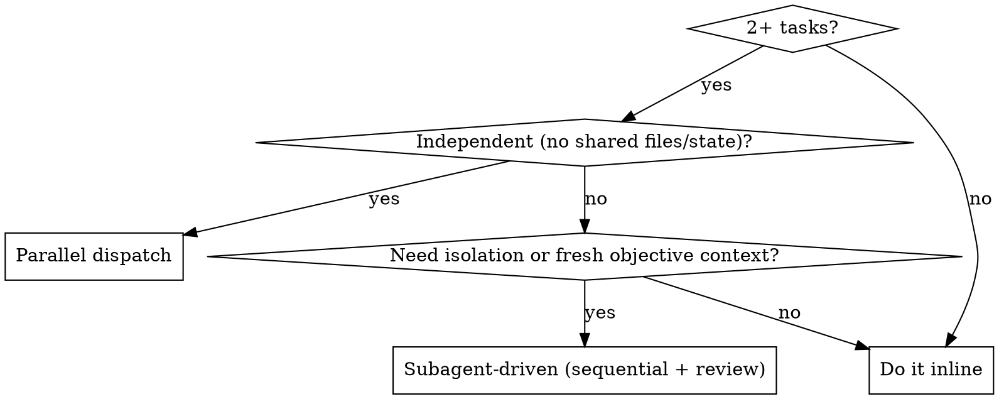

# Agent Teams — Master Reference Guide

A working reference for orchestrating multiple Claude Code agents on JobHelp. Use this
to decide **whether** to use a team, **which** pattern, **how** to scope each agent, and
**how** to keep parallel work from corrupting the tree.

Sources distilled here:
- Official docs: `https://code.claude.com/docs/en/agent-teams` and `…/sub-agents`
- Superpowers skills: `dispatching-parallel-agents`, `subagent-driven-development`,
  `requesting-code-review`, `receiving-code-review`, `executing-plans`
- This repo's own `CLAUDE.md` → **Parallel-agent discipline** (the load-bearing rules)

> The single most important rule on this repo: **file-level isolation**. N agents can run
> concurrently only if each owns a disjoint set of files. Violate that and the merge is
> corrupted. Everything below serves that rule.

---

## 1. When to use a team at all

Default to **doing it yourself inline**. A team is the expensive path: every spawned agent
starts cold and re-derives context you already hold. Reach for a team only when one of these
is true:

| Use a team when… | Stay solo when… |
|---|---|
| 2+ tasks are genuinely independent (no shared files, no shared state) | Tasks touch the same files or build on each other |
| Work fans out across many files/modules and you only need the conclusions | A single linear edit with verification |
| You want context isolation so the main thread stays focused on coordination | The whole job fits comfortably in one context |
| A task needs a read-only fact-check by a fresh, unbiased context (e.g. resume-validator) | "Thorough / multiple angles" — that's still one job; do it yourself |

"A task with several parts" is **not** a reason to spawn. Finish it inline. Spawn when the
parts are independent enough to run in parallel, or when isolation/objectivity is the point.



---

## 2. The two core patterns

### Pattern A — Parallel dispatch (fan-out)
Independent tasks run **simultaneously**, each in its own context. Agents **cannot
communicate during execution**; you aggregate results after all return.

- Dispatch by sending **one message with multiple `Agent`/Task calls**.
- Each agent needs **complete, self-contained instructions** — they share no context.
- Each agent owns a **disjoint file set**.
- You synthesize the outputs.

Best for: researching several questions at once, implementing features in separate modules,
running checks across unrelated components.

### Pattern B — Subagent-driven (orchestrate + review)
Sequential tasks with a **review checkpoint between each**. The orchestrator holds the plan;
each task goes to a fresh subagent; you verify (tests/tsc/build) before the next.

Best for: executing a written plan where tasks build on each other but you still want clean
context per task. Pairs with `writing-plans` → `executing-plans`.

| | Parallel dispatch | Subagent-driven |
|---|---|---|
| Concurrency | Simultaneous | One at a time |
| Dependencies | None allowed | Allowed (sequential) |
| Communication | None mid-flight | Orchestrator reviews between steps |
| Use when | Truly independent work | Dependent steps + isolation |

### Pattern C — Lead + teammates (official "Agent Teams")
The **experimental** built-in feature. Unlike subagents (Patterns A/B), teammates are
**full, independent Claude Code sessions** that can **message each other** and **self-claim**
from a shared task list — not just report back to the lead. Full mechanics in §12.

- Enable: set `CLAUDE_CODE_EXPERIMENTAL_AGENT_TEAMS=1` (env or `settings.json`'s `env` block).
- Requires Claude Code **v2.1.32+** and an Opus-class model.
- Created via **natural language** ("create an agent team to…"), not a slash command.
- Same discipline applies: small teams, non-overlapping file ownership, minimal tools each.

> Status on this machine: the agent-teams env var is **not currently set** (see memory obs
> 3191). Patterns A and B (plain `Agent`/Task dispatch + the superpowers skills) are the proven
> path here and need no flag. Treat Pattern C as opt-in/experimental until enabled.

**Subagents vs. agent teams — pick by whether workers must talk to each other:**

| | Subagents (Patterns A/B) | Agent teams (Pattern C) |
|---|---|---|
| Context | Own window; result returns to caller | Own window; fully independent session |
| Communication | Report back to caller only | Teammates message each other directly |
| Coordination | Lead manages all work | Shared task list + self-coordination |
| Token cost | Lower (result summarized back) | Higher (each teammate is a full instance) |
| Best for | Focused tasks where only the result matters | Work needing discussion, debate, collaboration |

---

## 3. Defining an agent (subagent schema)

Reusable agents live as Markdown files with YAML frontmatter:

| Location | Scope | Priority |
|---|---|---|
| `.claude/agents/` | This project | Highest (wins name conflicts) |
| `~/.claude/agents/` | All projects | Lower |

```markdown
---
name: your-agent-name          # required: lowercase + hyphens, unique
description: When to invoke it  # required: natural language; add "use PROACTIVELY"/"MUST BE USED" to bias auto-delegation
tools: Read, Grep, Glob, Bash  # optional: comma list; OMIT to inherit ALL tools (incl. MCP)
model: sonnet                  # optional: sonnet | opus | haiku | inherit
---

System prompt. Define role, scope, constraints, and the exact report format you expect back.
```

Field rules:
- **`tools` omitted ⇒ inherits everything** (broadest). Specify a list to constrain — least
  privilege is the default you want for focused workers.
- **`model`** lets you put cheap/fast models on mechanical work and `opus` on judgment work.
- Manage interactively with **`/agents`**; check project agents into version control.

---

## 4. The available agent roster (this environment)

Pick the narrowest agent that fits. Spawn a generic `claude`/`general-purpose` only when no
specialist matches.

| Agent | Use for | Notable limits |
|---|---|---|
| `Explore` | Broad read-only fan-out search across many files; you want the conclusion, not file dumps | Read-only; no Edit/Write/Agent. Specify breadth ("medium" / "very thorough") |
| `Plan` | Designing an implementation plan / architecture trade-offs | Read-only; no Edit/Write/Agent |
| `general-purpose` / `claude` | Multi-step tasks or searches that don't fit a specialist | Full tools; the catch-all |
| `code-simplifier` | Clarity/maintainability pass on **recently modified** code, behavior-preserving | Quality only, not bug hunting |
| `karen-the-auditor` | Read-only holistic health check → prioritized findings | Edits nothing |
| `karen-the-fixer` | One behavior-preserving fix per invocation, test-first | One change per call |
| `karen-the-manager` | Verify claimed-complete work is actually done | Edits nothing; can run tests |
| `karen` | Final pre-push gatekeeper; reviews **diffs only** | Last line of defense; assumes others ran |
| `claude-code-guide` | Questions about Claude Code / Agent SDK / Claude API | Bash/Read/WebFetch/WebSearch |
| `resume-tailor` | JobHelp resume tailoring (round 1 draft / round 2 edits) | Never fabricates; MCP-scoped tools |
| `resume-validator` | Independent fact-check of a tailored resume vs. the original | NEVER reads the JD; objectivity by design |
| `statusline-setup` | Configure the status line | Narrow |

**Karen chain (the repo's audit rhythm):** auditor (find) → fixer (one fix) → manager
(verify) → karen (gatekeeper). Read-only and write roles are deliberately separated.

---

## 5. Scoping an agent prompt (the contract)

A dispatched agent shares **none** of your context. The prompt is the entire contract. Every
dispatch must contain:

1. **Goal** — one sentence: what "done" looks like.
2. **Owned file set** — exact files/dirs this agent MAY modify or create.
3. **Forbidden set** — everything else (or an explicit list). State it.
4. **Interfaces it depends on** — any API/type from a sibling's work, given concretely so it
   can code against it guarded (`if (typeof x.foo === 'function')`) instead of reaching into
   another agent's file.
5. **Verification it must run** — `npx vitest run`, `npx tsc --noEmit`, relevant build; and to
   quote the actual tail, not assert success.
6. **Report format** (see §7).
7. **Repo guardrails** — point at `CLAUDE.md`; it applies to every dispatched subagent too.

Self-contained beats clever. Vague instructions are the #1 cause of wasted parallel work.

---

## 6. Parallel-agent discipline (non-negotiable on this repo)

These mirror `CLAUDE.md` → *Parallel-agent discipline*. Put them verbatim-in-spirit into
every parallel worker's prompt.

1. **Never edit a file you weren't assigned** — not a one-line "while I'm here" fix, not even
   to make your own tests pass. Another agent may own it; your edit collides.
2. **Don't "fix" half-finished files** — a failing test or tsc error in an unowned file is
   almost certainly a sibling's in-flight change. Leave it.
3. **Don't run the full suite and then "repair" the tree** — the suite is *expected* to be
   temporarily red mid-flight. Verify only that **your owned files compile and your
   owned/added tests pass**. If the only failures are outside your scope, report
   "my files clean; failures in <list> are not mine" and stop.
4. **Need a sibling's new API?** Code against it guarded, or **flag the dependency** — don't
   pre-add it in their file.
5. **Cross-impact flag format:** when your work implies a change outside your scope, write a
   line prefixed `CROSS-IMPACT:` naming the exact file + change (file:line, before/after
   sketch). Do **not** apply it yourself.
6. **Test files:** only touch test files you own. A stale assertion in a sibling's test caused
   by your change is a `CROSS-IMPACT:`, not your edit.
7. **When in doubt, do less.** A small cleanly-scoped change the orchestrator can integrate
   beats a sprawling one that has to be unpicked.

**Stronger isolation when needed:** run an agent in its own **git worktree**
(`isolation: "worktree"`) so concurrent edits can't even physically collide; the worktree is
auto-cleaned if unchanged. Use for risky or heavily-overlapping work.

---

## 7. Report format (every agent returns this)

Keep it tight. The orchestrator integrates from this, so it must be faithful — failures
reported as failures, skips as skips.

- **Created/changed** — file-by-file, one line each.
- **Tested** — test names added/modified, count delta, the actual `npx vitest run` tail,
  `tsc` result, build result.
- **Approach** — key design decisions and why.
- **Cross-impacts / follow-ups** — `CROSS-IMPACT:` lines for forbidden-file changes needed;
  anything unfinished; pre-existing/in-flight breakage observed but (correctly) not touched.

Remember: an agent's final message comes back to **you**, not the user. Relay what matters.

---

## 8. Orchestrator responsibilities

You (the lead) own everything the workers can't see:

1. **Decompose** so file sets are disjoint. If two tasks must touch one file, either serialize
   them or split that file along its 300-line/responsibility seams **first**.
2. **Assign ownership explicitly** and hand each agent the interfaces it needs.
3. **Dispatch** — one message, multiple calls for parallel; sequential with review for
   subagent-driven.
4. **Integrate** — apply `CROSS-IMPACT:` changes yourself; reconcile shared types
   (e.g. `api-contract.ts` exists in two copies that must stay byte-identical).
5. **Verify the whole** — only after integration run the **full** gate:
   `npx vitest run` green + `npx tsc --noEmit` clean + relevant builds; for publication-wide
   work, `node scripts/verify-bundle.mts`. Quote the tail.
6. **Review** — for non-trivial merges, run the karen chain and/or `requesting-code-review`
   before declaring done.

---

## 9. JobHelp-specific decomposition tips

The repo is already structured for clean file-level splits:

- **300-line cap** per source file. If a planned change would blow a file past 300 lines,
  split it (sibling module → `lib/` → `types/` → split tests by surface) **before** assigning,
  re-exporting the original surface so imports stay intact. This also creates natural,
  disjoint ownership boundaries for agents.
- **Two `api-contract.ts` copies** (extension SOURCE OF TRUTH + appsscript mirror) must stay
  byte-identical except the header comment. Don't hand these two files to two different agents
  — one agent owns both, or the orchestrator syncs them post-merge.
- **MCP layering:** `mcp/src/` stays thin/protocol-facing; durable behavior lives in `core/`.
  Split work along that seam — protocol agent vs. core-logic agent rarely collide.
- **Source adapters** (`core/sources/*`) are 17 sibling files — ideal parallel fan-out, one
  adapter per agent, zero overlap.
- **Apps Script V8 constraints** (no async/await/Promise.all in the request path, GAS globals
  guarded for vitest) apply to any agent touching `extension-app/appsscript/`.
- **MCP zero-API-key rule:** no agent may add server-side LLM calls or require an Anthropic key
  in `jobhelp-mcp`.

---

## 10. Anti-patterns (don't)

- Spawning agents for **dependent** tasks → conflicts and wasted work. Serialize instead.
- **Vague** prompts that assume shared context the agent doesn't have.
- Two agents on the **same file** → merge conflict by construction.
- An agent **"repairing" the red tree** caused by siblings → reverts in-flight work.
- Spawning to feel productive on a job you could finish inline in less time than a cold start.
- Trusting "all tests pass" from an agent **without the quoted tail**.
- Large teams "to be thorough" — more agents = more tokens + coordination overhead, not more
  correctness. Keep teams small and focused.

---

## 11. Quick checklist before you dispatch

- [ ] Is this genuinely 2+ independent tasks, or am I avoiding doing it inline?
- [ ] Are the file sets **disjoint**? (If not, split files or serialize.)
- [ ] Does each prompt have goal + owned set + forbidden set + interfaces + verification +
      report format?
- [ ] Did I tell each agent the parallel-discipline rules (or point at `CLAUDE.md`)?
- [ ] Do I have an integration + full-gate verification plan for after they return?
- [ ] For risky overlap: worktree isolation?

---

## 12. Official Agent Teams — full reference (the built-in feature)

Everything below is the experimental `CLAUDE_CODE_EXPERIMENTAL_AGENT_TEAMS` feature, distilled
from `code.claude.com/docs/en/agent-teams`. Use it when teammates need to **talk to each other**
(challenge findings, debate hypotheses, coordinate across layers) — not just report back.

### Requirements & enable
- Claude Code **v2.1.32+** (`claude --version`); Opus-class model.
- Off by default. Enable in `settings.json`:
  ```json
  { "env": { "CLAUDE_CODE_EXPERIMENTAL_AGENT_TEAMS": "1" } }
  ```

### Architecture

| Component | Role |
|---|---|
| **Team lead** | The main session: creates the team, spawns teammates, coordinates, synthesizes |
| **Teammates** | Separate full Claude Code instances, each on assigned tasks, each own context window |
| **Task list** | Shared work items teammates claim/complete; supports dependencies (auto-unblock) |
| **Mailbox** | Messaging system; teammates message the lead and each other by name (`SendMessage`) |

Local state (auto-generated; **do not hand-edit or pre-author** — overwritten on state update):
- Team config: `~/.claude/teams/{team-name}/config.json` (holds session IDs, tmux pane IDs, a
  `members` array of name/agent-id/agent-type).
- Task list: `~/.claude/tasks/{team-name}/`.
- There is **no** project-level team config; `.claude/teams/*.json` is treated as an ordinary file.

### Starting & controlling
- **Create**: natural language — e.g. *"Create an agent team to explore this from three angles:
  one on UX, one on architecture, one playing devil's advocate."* Claude can also **propose** a
  team; you always confirm first.
- **Specify size/model**: *"Create a team with 4 teammates… use Sonnet for each."* Teammates
  **don't** inherit the lead's `/model`; set **Default teammate model** in `/config` (or pick
  "leader's model").
- **Plan approval**: *"…require plan approval before they make changes."* Teammate stays in
  read-only plan mode until the lead approves/rejects; influence the lead with criteria like
  "only approve plans with test coverage."
- **Direct messaging**: each teammate is interactive — `Shift+Down` cycles teammates
  (in-process), or click a pane (split). `Ctrl+T` toggles the task list.
- **Shut down**: *"Ask the researcher teammate to shut down."* **Clean up**: *"Clean up the team"*
  — always via the **lead**, and only after teammates have stopped.

### Display modes
- **In-process** (default `auto` when not in tmux): all teammates in your terminal; works anywhere.
- **Split panes**: one pane per teammate; needs **tmux** or **iTerm2 + `it2` CLI**. Not supported
  in VS Code integrated terminal, Windows Terminal, or Ghostty.
- Override via `~/.claude/settings.json` `"teammateMode"` or `claude --teammate-mode in-process`.

### Reusing your subagents as teammates
Reference any subagent type by name: *"Spawn a teammate using the security-reviewer agent type…"*
- The teammate honors that definition's `tools` allowlist and `model`; its body is **appended**
  to the system prompt (doesn't replace it).
- `SendMessage` + task-management tools are **always** available even if `tools` is restrictive.
- **Caveat:** `skills` and `mcpServers` frontmatter fields are **ignored** for teammates —
  teammates load skills/MCP from project + user settings like a normal session.
- Teammates load `CLAUDE.md` from their working dir (so JobHelp's rules apply automatically) but
  do **not** inherit the lead's conversation history — put task specifics in the spawn prompt.

### Quality gates via hooks
Exit code **2** in any of these sends feedback and blocks the action:
- `TeammateIdle` — fires before a teammate goes idle (keep it working).
- `TaskCreated` — fires on task creation (prevent + give feedback).
- `TaskCompleted` — fires on completion (prevent marking done + give feedback).

### Best-practice numbers
- **3–5 teammates** for most work; three focused beat five scattered.
- **5–6 tasks per teammate**; 15 independent tasks → ~3 teammates.
- Size tasks to a clear deliverable (a function, a test file, a review). Permissions are set at
  spawn from the lead's mode; pre-approve common ops to cut prompt friction.

### Known limitations (experimental)
- `/resume` and `/rewind` don't restore in-process teammates — re-spawn after resume.
- Task status can lag (teammates forget to mark complete) → dependents stall; nudge or fix manually.
- Shutdown is slow (finishes current tool call). **One team at a time**; **no nested teams**;
  **lead is fixed** for the team's lifetime.
- Orphaned tmux sessions: `tmux ls` then `tmux kill-session -t <name>`.

### Two canonical use cases
- **Parallel code review**: spawn reviewers with distinct lenses (security / performance / test
  coverage) on the same PR; lead synthesizes.
- **Competing-hypotheses debugging**: spawn N investigators told to **disprove each other's**
  theories; the surviving theory is far likelier the true root cause (beats single-agent anchoring).

---

### Sources
- [Orchestrate teams of Claude Code sessions](https://code.claude.com/docs/en/agent-teams)
- [Subagents](https://code.claude.com/docs/en/sub-agents) ·
  [Git worktrees](https://code.claude.com/docs/en/worktrees) ·
  [Hooks](https://code.claude.com/docs/en/hooks)
- Superpowers skills: `dispatching-parallel-agents`, `subagent-driven-development`
- This repo: `CLAUDE.md` → *Parallel-agent discipline*
