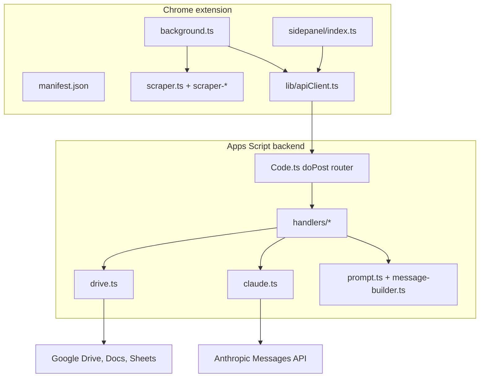

# JobHelp Extension App

The extension app is the browser-based JobHelp product. It combines a Chrome Manifest V3 extension with a Google Apps Script backend that runs in the user's Google account.

Use it when you want to open a job posting, scrape the job description, tailor a resume, write outputs to Drive, export DOCX/PDF, generate optional cover letters or critiques, and log the application to Google Sheets.

## Product Pieces

| Piece | Path | Responsibility |
| --- | --- | --- |
| Chrome extension | `extension-app/extension/` | Side panel UI, background worker, page scraper, settings, local config cache, client-side DOCX/template helpers |
| Apps Script backend | `extension-app/appsscript/` | HTTP router, Drive/Docs/Sheets writes, Anthropic calls, feature handlers, prompt composition |
| Prompt rules | `extension-app/prompts/shared/` | Generation, truthfulness, structure, cover-letter, and auto-revise rules |
| Cross-package tests | `extension-app/tests/` | Contract tests, smoke tests, fixtures, and shared UI safety tests |

## User Workflow

1. Deploy the Apps Script backend from `extension-app/appsscript/dist/Code.gs`.
2. Install the unpacked Chrome extension from `extension-app/extension/public/`.
3. Create or load a Drive-hosted `jobhelp-config.json`.
4. Seed rule files into the configured Drive rules folder.
5. Open a supported job posting.
6. Open the JobHelp side panel.
7. Review scraped company, role, URL, job description, and job insights.
8. Click Generate.
9. Review the tailored markdown, then save, finalize, revise, critique, or generate a cover letter as needed.

The Jobs tab can also run an optional discovery digest and prefill Generate from a ranked job. That extension workflow currently supports a narrower set of discovery sources than the JobHelp MCP source adapters.

For the click-by-click setup path, use [../docs/setup-for-new-users.md](../docs/setup-for-new-users.md).

## Architecture



## Runtime Flow

### Scrape

- The background worker watches tab activation and page-load completion.
- It injects the scraper bundle into supported pages.
- The scraper uses hostname, DOM structure, JSON-LD, metadata, and fallback text extraction.
- The side panel receives `ScraperOutput` with job description, company, role, strategy, timestamp, and `JobInsights`.

### Generate

- The Generate tab gathers scraped fields, model selection, folders, sheet ID, and optional feature outputs.
- The background worker calls the Apps Script `generate` action.
- The backend reads source materials and rule files, composes the system/user prompt, calls Anthropic, writes Drive output, and appends the tracking-sheet row.
- The side panel displays returned markdown, cost, keyword coverage, Google Doc URL, Drive folder URL, and sheet row URL.

### Post-Generate Actions

| Action | Backend handler | Result |
| --- | --- | --- |
| Finalize | `Code.ts` finalize path | Exports edited markdown to DOCX/PDF through Google Docs |
| Critique | `handlers/critique.ts` | Scores the generated resume and optionally writes critique output |
| Auto-revise | `handlers/autoRevise.ts` | Returns revised markdown, diff, and out-of-scope change warnings |
| Cover letter | `handlers/coverLetter.ts` | Writes cover letter Markdown and Google Doc |
| Verify hooks | `handlers/verifyHooks.ts` | Checks named entities in a cover letter with web search |
| Multi-version | `handlers/multiVersion.ts` | Creates multiple resume framings for comparison |

## Configuration

The source of truth is a Drive file named `jobhelp-config.json`. The config includes:

- Apps Script `/exec` URL
- Anthropic API key
- Source, rules, and output folder IDs
- Tracking sheet ID
- Optional template DOCX file ID
- Default model and preferences

The extension stores the Drive config file ID locally so it can reload the file on each machine. The side panel loads the file through `configLoader.ts`, validates the schema, keeps a session runtime config, and mirrors selected values into legacy storage keys while older background-worker paths still need them.

Current Jobs-tab discovery credentials and digest/profile caches are also stored locally during this migration window; the Drive config remains the source of truth for the core extension setup.

Do not commit real config files, API keys, Apps Script URLs, Drive IDs tied to private data, generated resumes, or tracking sheets.

## Source Materials And Rules

Source materials are Markdown files in the configured Drive source folder. The backend concatenates them before generation.

Rules are Markdown files seeded from `extension-app/prompts/shared/` into the configured Drive rules folder. They control truthfulness, formatting, output shape, cover-letter style, and revision discipline.

Key rules:

- `02-anti-fabrication.md`
- `06-bullet-construction.md`
- `08-bridge-language.md`
- `11-self-scan-checklist.md`
- `13-output-shape.md`
- `14-revision-discipline.md`

## Build And Verify

Run from the repo root:

```bash
npm install
npx tsc --noEmit
npx vitest run
node extension-app/extension/scripts/build.mts
node extension-app/appsscript/scripts/build.mts
node scripts/verify-bundle.mts
```

Focused checks:

```bash
npx vitest run extension-app/tests/sidepanel/resumeEditor-selection.test.ts
npx vitest run extension-app/tests/contracts/verify-bundle-actions.test.ts
node scripts/verify-bundle.mts
```

## Local Installation

```bash
node extension-app/extension/scripts/build.mts
```

Then open `chrome://extensions`, enable Developer mode, click Load unpacked, and select `extension-app/extension/public/`.

After source changes, rebuild and reload the unpacked extension. For background-worker changes, inspect the service-worker console from the extension card.

## Deploy Apps Script

```bash
node extension-app/appsscript/scripts/build.mts
```

Paste `extension-app/appsscript/dist/Code.gs` into a new Apps Script project and deploy it as a web app. The user-facing setup guide has the exact Google UI steps: [../docs/setup-for-new-users.md](../docs/setup-for-new-users.md).

## Developer Notes

- The backend is synchronous Apps Script V8. Do not use Node APIs or async fan-out in request-path backend code.
- The scraper runs inside arbitrary job pages. Avoid Node APIs and page-global assumptions.
- `extension-app/extension/src/types/api-contract.ts` is the source of truth for the wire contract; mirror changes to `extension-app/appsscript/src/types/api-contract.ts`.
- Use structured loggers in both packages.
- Keep generated JS bundles under `extension-app/extension/public/` reproducible from source.
- Prefer cohesive helper modules over growing handler or UI files past 300 lines.

## License And Publication

MIT under the repo root [LICENSE](../LICENSE). The software is provided as-is, without warranty or liability for misuse.

## Related Docs

- [extension/README.md](extension/README.md) for Chrome extension internals.
- [../docs/v2-features.md](../docs/v2-features.md) for optional feature behavior.
- [../docs/security.md](../docs/security.md) for secret storage and threat model.
- [../docs/setup-for-new-users.md](../docs/setup-for-new-users.md) for first-run setup.
